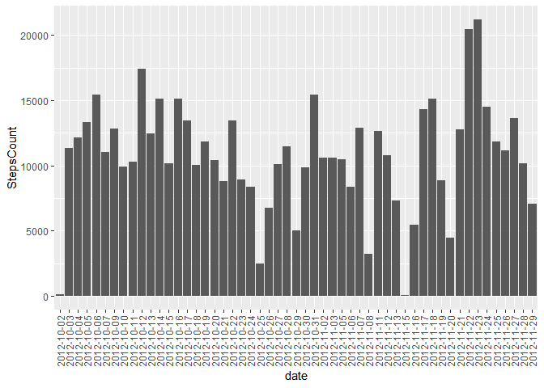
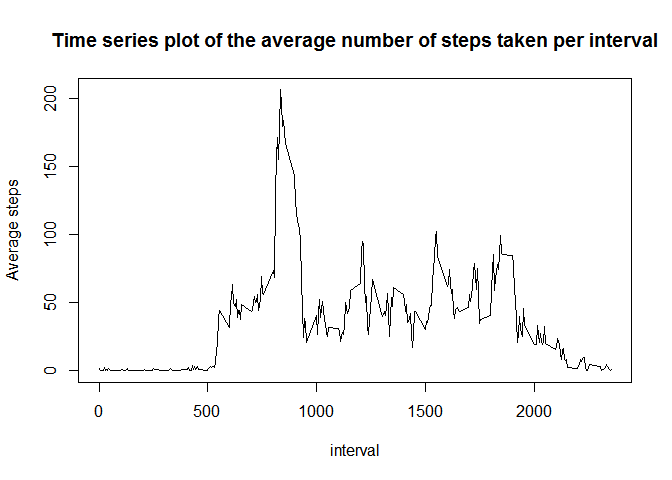
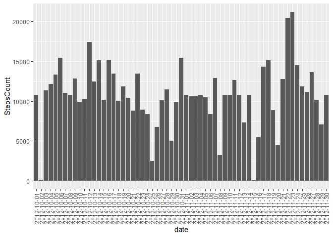
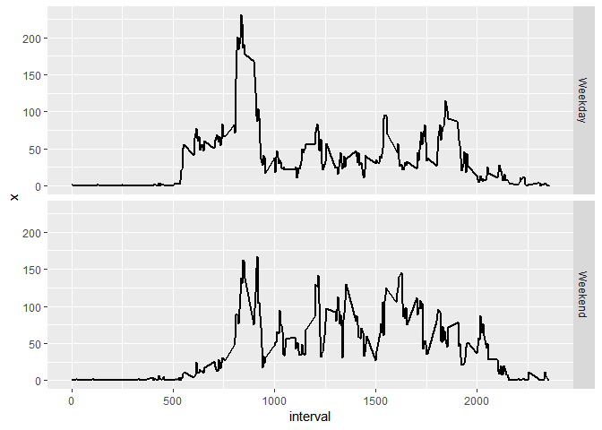

## Loading and preprocessing the data

```r
activity_data <- read.csv("activity.csv")
activity_dataNoNA <- na.omit(activity_data)
dailysteps <- aggregate(activity_dataNoNA$steps, by=list(date=activity_dataNoNA$date), FUN=sum)
names(dailysteps)[2] <- "StepsCount"
```


## What is mean total number of steps taken per day?

```r
library(ggplot2)
a <- ggplot(dailysteps,aes(x = date, y = StepsCount))
a <- a + geom_bar(stat = "identity")
a <- a + theme(axis.text.x = element_text(angle = 90, vjust = 0.5))
a
```

<!-- -->

Mean and median number of steps taken each day

```r
mean(dailysteps$StepsCount)
```

```
## [1] 10766.19
```

```r
median(dailysteps$StepsCount)
```

```
## [1] 10765
```

## What is the average daily activity pattern?

```r
dailyactivity <- aggregate(activity_dataNoNA$steps, by=list(interval=activity_dataNoNA$interval), FUN=mean)
names(dailyactivity)[2] <- "Average"
plot(dailyactivity$interval, dailyactivity$Average, type = "l", main = "Time series plot of the average number of steps taken per interval", xlab = "interval", ylab = "Average steps")
```

<!-- -->

Interval, accross all days,  with the highest average number of steps

```r
dailyactivity[which.max(dailyactivity$Average),]
```

```
##     interval  Average
## 104      835 206.1698
```

## Imputing missing values

number of missing values in the dataset

```r
sum(is.na(activity_data$steps))
```

```
## [1] 2304
```

This code shows that I will be using the daily Average when missing a measurment.

```r
imputActivityData <- merge(dailyactivity, activity_data, by = "interval")
imputActivityData$steps <- ifelse(is.na(imputActivityData$steps), imputActivityData$Average, imputActivityData$steps)
```

Histogram of the total number of steps taken each day after missing values are imputed

```r
dailystepsimput <- aggregate(imputActivityData$steps,by=list(date=imputActivityData$date), FUN=sum)
names(dailystepsimput)[2] <- "StepsCount"
a <- ggplot(dailystepsimput,aes(x = date, y = StepsCount))
a <- a + geom_bar(stat = "identity")
a <- a + theme(axis.text.x = element_text(angle = 90, vjust = 0.5))
a
```

<!-- -->


Panel plot comparing the average number of steps taken per 5-minute interval across weekdays and weekends

```r
imputActivityData$day <- weekdays(as.Date(imputActivityData$date))
imputActivityData$day[imputActivityData$day == "Monday"] <- "Weekday"
imputActivityData$day[imputActivityData$day == "Tuesday"] <- "Weekday"
imputActivityData$day[imputActivityData$day == "Wednesday"] <- "Weekday"
imputActivityData$day[imputActivityData$day == "Thursday"] <- "Weekday"
imputActivityData$day[imputActivityData$day == "Friday"] <- "Weekday"
imputActivityData$day[imputActivityData$day == "Saturday"] <- "Weekend"
imputActivityData$day[imputActivityData$day == "Sunday"] <- "Weekend"

AverageByDaytype = aggregate(imputActivityData$steps, by=list(interval=imputActivityData$interval, day = imputActivityData$day), FUN=mean)
bp <- ggplot(AverageByDaytype, aes(x=interval, y = x))
bp <- bp + facet_grid(day ~ .)
bp <- bp + geom_line(size = 1)
bp
```

<!-- -->
